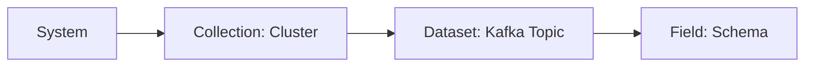
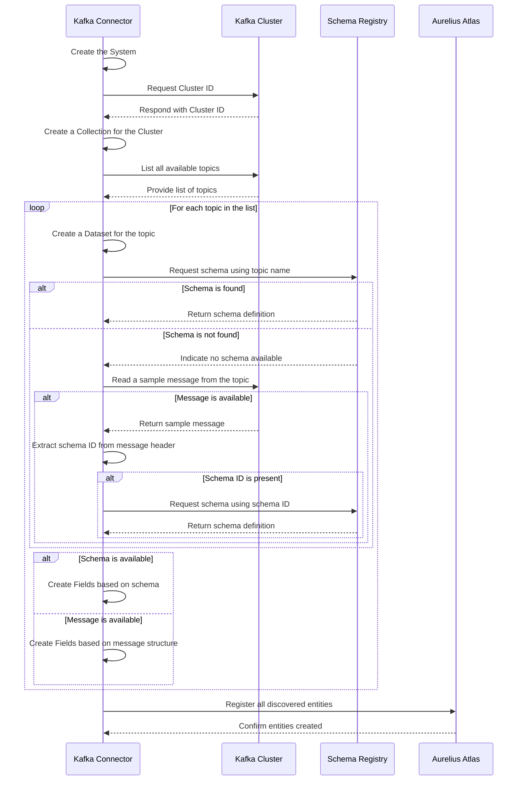

# Aurelius Atlas Kafka Connector

This project provides a connector for integrating Kafka clusters with the Aurelius Atlas data dictionary. It allows for
the discovery of Kafka topics and their associated metadata, enabling users to manage and document their Kafka data streams
effectively.

## Usage

The Kafka connector runs as a batch job in the Data Dictionary IO application. It can be executed by starting up the Docker container
with the `SOURCE` environment variable set to `kafka`.

```bash
docker run -e SOURCE=kafka m4i-data-dictionary-io
```

## Configuration

In addition to the `SOURCE` environment variable, the following configuration options can be set:

| Environment Variable            | Description                                                                | Required | Default Value        |
|---------------------------------|----------------------------------------------------------------------------|----------|----------------------|
| `ATLAS_SERVER_URL`              | The URL of the Atlas server to connect to.                                 | Yes      | `None`               |
| `BOOTSTRAP_SERVERS`             | The Kafka bootstrap servers to connect to.                                 | Yes      | `None`               |
| `CONSUMER_GROUP_ID_PREFIX`      | The prefix for the consumer group ID used by the connector.                | Yes      | `data-dictionary-io` |
| `KEYCLOAK_ATLAS_ADMIN_PASSWORD` | The password for the user with create permissions in Atlas.                | Yes      | `None`               |
| `KEYCLOAK_CLIENT_ID`            | The Keycloak client ID for authentication.                                 | Yes      | `m4i_atlas`          |
| `KEYCLOAK_CLIENT_SECRET_KEY`    | The Keycloak client secret key.                                            | Yes      | `None`               |
| `KEYCLOAK_REALM_NAME`           | The Keycloak realm name.                                                   | Yes      | `m4i`                |
| `KEYCLOAK_SERVER_URL`           | The URL of the Keycloak server.                                            | Yes      | `None`               |
| `KEYCLOAK_USERNAME`             | The Keycloak username for authentication.                                  | Yes      | `None`               |
| `SOURCE`                        | The source of the data to be processed. Set to `kafka` for this connector. | Yes      | `excel`              |
| `SCHEMA_REGISTRY_URL`           | The URL of the Schema Registry to use for schema retrieval.                | No       | `None`               |
| `SYSTEM_NAME`                   | The name of the system to be created in Atlas.                             | No       | `Kafka Broker`       |
| `VALIDATE_QUALIFIED_NAME`       | Whether to validate the qualified names of entities.                       | No       | `False`              |

## Data Model

The following datamodel is created by discovering the kafka cluster.



### System
  
This component is the system to which the Kafka cluster belongs. For example, it could be part of a data integration system
or a data processing platform. The name of the system is set to "kafka_system" by default, but it can be customized by
passing a different name when calling the discovery function.

### Collection

The collection represents the Kafka cluster itself. It serves as a container for all datasets (Kafka topics) within that
cluster. The qualified name of the cluster is based on the system it belongs to and the cluster id.

### Dataset

Datasets represents individual Kafka topics within the cluster. Each dataset is identified by its topic name and the cluster
it belongs to.

### Field

Fields represent the content of the messages within each Kafka topic. The fields are derived from either the schema of
the messages, or from the actual message data itself if no schema is available.

## Flow

The following diagram illustrates how the connector interacts with the Kafka cluster to discover topics and their metadata.


