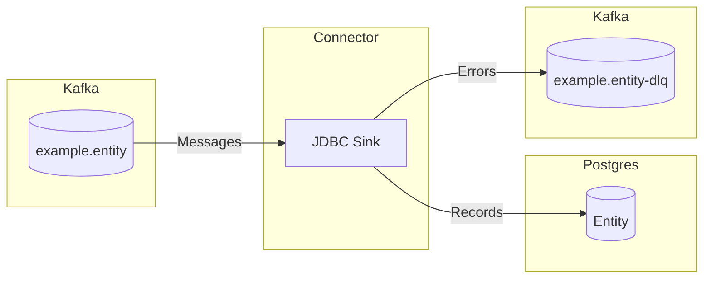

# aurelius-kafka-connect-jdbc-sink-example

[](https://sonarcloud.io/summary/new_code?id=aurelius-kafka-connect-jdbc-sink-example)

This is an example Kafka Connect JDBC Sink application.

## Workflow



The connector reads messages from the `example.entity` Kafka topic, processes each message, and writes the resulting
data to the `Entity` table in Postgres.

??? QUESTION "What happens if the database is unavailable?"

    If the database is unavailable, the connector will retry processing the messages at a later time.

??? QUESTION "What happens if processing fails?"

    If processing fails, the connector forwards the problematic message to the dead-letter queue topic `example.entity-dlq`.

## Key Schema

Keys should be string representations of the entity's [`guid`][aurelius_example.models.Entity.guid]
field.

## Value Schema

Values are expected to be Avro-encoded records that conform to the [`Entity`][aurelius_example.models.Entity]
schema.

??? INFO "Entity Schema"

    ::: aurelius_example.models.Entity

The schema is registered in the schema registry as `com.aureliusenterprise.example.Entity`.

## Tombstone Messages

The connector also supports tombstone messages, which are used to delete records from the database. Tombstone
messages should have a key that matches the entity's [`guid`][aurelius_example.models.Entity.guid] field and a
value that is `null`.

## Configuration

This example runs Kafka Connect in standalone mode and uses two properties files:

- `workers/worker.properties` for worker runtime settings
- `workers/connector.properties` for this JDBC sink connector instance

### Standalone startup in Docker Compose

Set the service entrypoint to `connect-standalone.sh` and pass the worker file first, then the connector file:

```yaml
services:
    kafka-connect:
        image: ghcr.io/aureliusenterprise/aurelius-kafka-connect-jdbc-sink-example:local
        entrypoint: ["/opt/kafka/bin/connect-standalone.sh"]
        command: ["/connect-worker", "/connect-connector"]
        configs:
            - connect-worker
            - connect-connector

configs:
    connect-worker:
        file: ./workers/worker.properties
    connect-connector:
        file: ./workers/connector.properties
```

### Worker configuration environment variables

These environment variables are referenced by `workers/worker.properties`:

| Name                        | Description                                           |
| --------------------------- | ----------------------------------------------------- |
| `KAFKA_BOOTSTRAP_SERVERS`   | Kafka bootstrap servers.                              |
| `CONFIG_STORAGE_TOPIC`      | Connect config storage topic name.                    |
| `GROUP_ID`                  | Connect worker group ID.                              |
| `OFFSET_STORAGE_TOPIC`      | Connect offset storage topic name.                    |
| `STATUS_STORAGE_TOPIC`      | Connect status storage topic name.                    |
| `REST_ADVERTISED_HOST_NAME` | Hostname advertised by the Connect REST API.          |
| `REST_PORT`                 | Connect REST API port.                                |
| `SCHEMA_REGISTRY_URL`       | Schema Registry URL used by the Avro value converter. |

`worker.properties` also sets `offset.storage.file.filename`, which is required for standalone mode.

### Connector configuration environment variables

These environment variables are referenced by `workers/connector.properties`:

| Name                | Description                                               |
| ------------------- | --------------------------------------------------------- |
| `DATABASE_URL`      | JDBC URL for the target Postgres database.                |
| `DATABASE_USERNAME` | Database username.                                        |
| `DATABASE_PASSWORD` | Database password.                                        |
| `KAFKA_TOPIC_NAME`  | Source topic consumed by the sink connector.              |
| `DLQ_TOPIC_NAME`    | Dead-letter queue topic for records that fail processing. |
| `TABLE_NAME`        | Destination table name used by the JDBC sink connector.   |
