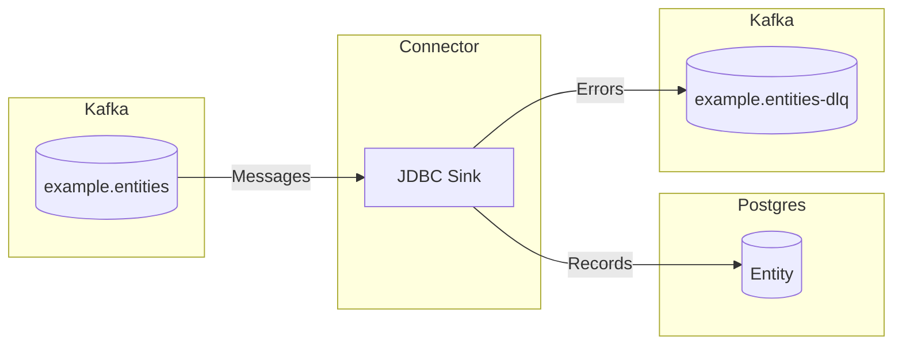

# aurelius-kafka-connect-jdbc-sink-example

This is an example Kafka Connect JDBC Sink application.

## Workflow

The connector reads messages from the `example.entities` Kafka topic, processes each message, and writes the resulting
data to the `Entity` table in Postgres.

??? QUESTION "What happens if the database is unavailable?"

    If the database is unavailable, the connector will retry processing the messages at a later time.

??? QUESTION "What happens if processing fails?"

    If processing fails, the connector forwards the problematic message to the dead-letter queue topic `example.entities-dlq`.

## Key Schema

Keys should be string representations of the entity's [`guid`][aurelius_example.models.Entity.guid]
field.

## Value Schema

Values are expected to be Avro-encoded records that conform to the [`Entity`][aurelius_example.models.Entity]
schema.

??? INFO "Entity Schema"

    ::: aurelius_example.models.Entity

The schema is registered in the schema registry as `aurelius_example.models.Entity`.

## Tombstone Messages

The connector also supports tombstone messages, which are used to delete records from the database. Tombstone messages
should have a key that matches the entity's [`guid`][aurelius_example.models.Entity.guid]
field and a value that is `null`.

## Configuration

The connector can be configured using the following environment variables:

| Name                                          | Description                                                        |
| --------------------------------------------- | ------------------------------------------------------------------ |
| `CONFIG_CONSUMER_GROUP`                       | The consumer group ID for the connector.                           |
| `CONFIG_DATABASE_PASSWORD`                    | The password for the database.                                     |
| `CONFIG_DATABASE_URL`                         | The URL of the database.                                           |
| `CONFIG_DATABASE_USERNAME`                    | The username for the database.                                     |
| `CONFIG_DLQ_TOPIC_NAME`                       | The name of the dead-letter queue topic.                           |
| `CONFIG_KAFKA_TOPIC_NAME`                     | The name of the input Kafka topic.                                 |
| `CONFIG_SCHEMA_REGISTRY_URL`                  | The URL of the schema registry.                                    |
| `CONFIG_TABLE_NAME`                           | The name of the table where data should be stored.                 |
| `CONNECT_BOOTSTRAP_SERVERS`                   | The Kafka bootstrap servers to connect to.                         |
| `CONNECT_CONFIG_STORAGE_TOPIC`                | The name of the topic where the connector configuration is stored. |
| `CONNECT_GROUP_ID`                            | The unique consumer group ID for the connector.                    |
| `CONNECT_OFFSET_STORAGE_TOPIC`                | The name of the topic where the offsets are stored.                |
| `CONNECT_STATUS_STORAGE_TOPIC`                | The name of the topic where the connector status is stored.        |
| `CONNECT_VALUE_CONVERTER_SCHEMA_REGISTRY_URL` | The URL of the schema registry for the value converter.            |
