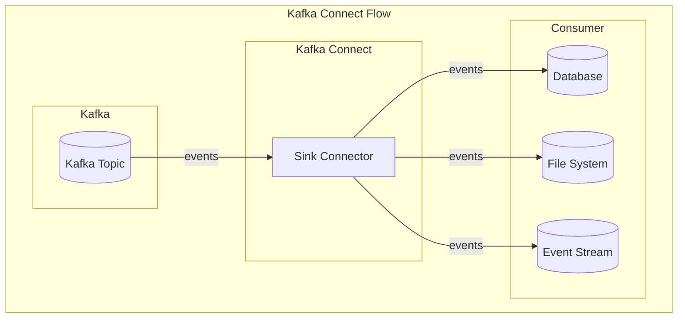
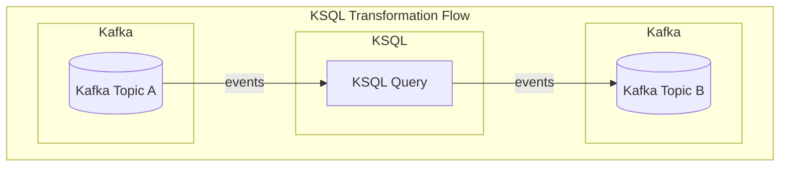
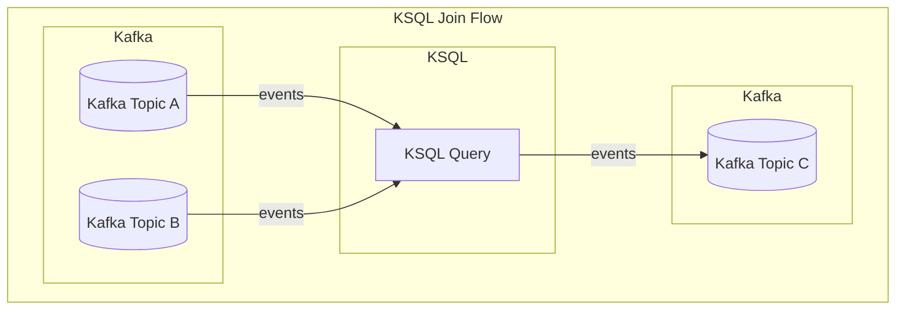
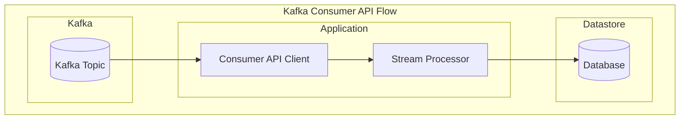
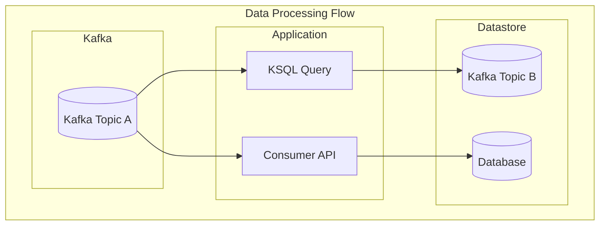
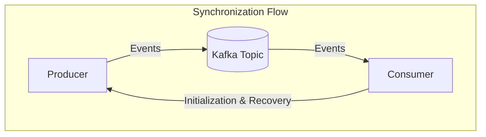
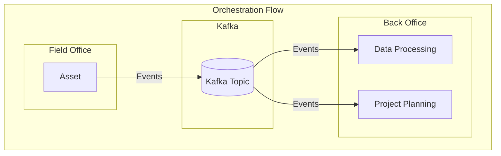
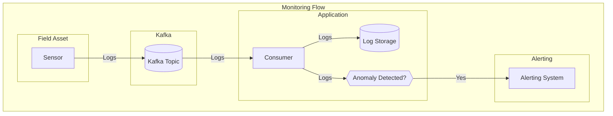

# Consumers

This section describes how to connect as a Kafka consumer and subscribe to events from a topic.

## How to Consume Data from Kafka

The best way to consume data from Kafka depends on your use case. The following are common ways to consume data
from Kafka:

### Kafka Connect

Kafka Connect is a no-code framework for connecting Kafka with external systems such as databases, key-value stores,
search indexes, and file systems.

Read more about Kafka Connect in the official [Kafka documentation](https://kafka.apache.org/documentation/#connect).

!!! SUCCESS "Prefer Kafka Connect"

    Kafka Connect is the preferred way for to integrate for consumers, since it is a scalable and fault-tolerant
    way to read data from Kafka without needing to write custom code or modify existing sytems.

#### When to Use Kafka Connect

Kafka Connect is a good choice when you need to consume data from a Kafka topic with minimal to no data processing
requirements.

While there are many different pre-built sink connectors available for Kafka Connect, not all target systems may
be supported. Confluent offers [Confluent Hub](https://www.confluent.io/hub/) where you can find a curated list
of connectors that have been tested and are known to work well. There are also many open source connectors available
on GitHub and other platforms.

??? QUESTION "How do I find the right sink connector?"

    Start by searching for sink connectors with the name of the system you want to connect to. If there is no
    connector for your system, it's worth searching for the protocol or technology you are using. For example, most
    relational databases can be connected to using JDBC, and there are several JDBC sink connectors available.

    If you find a connector that suits your needs, you should review its documentation to see if it is actively maintained
    and available with a sufficiently permissive license. For example, some of the connectors offered on Confluent Hub are
    only available with a paid enterprise license.

For simple data transformation, Kafka Connect can be used with [Single Message Transforms (SMT)](https://docs.confluent.io/platform/current/connect/transforms/overview.html).
SMTs are small pieces of code that can be applied to individual events as they are read from a Kafka topic. For
example, you can use an SMT to filter events based on a condition, or to convert a field to a different data type.

If there are no compatible connectors available, or if you have complex data processing requirements, you may need
to use the [Kafka Consumer API](#kafka-consumer-api) instead.

#### How to Use Kafka Connect

The diagram below shows how Kafka Connect can be used to consume data from a Kafka topic:

In this diagram, the Sink Connector reads events from a Kafka topic and writes them to different target systems,
such as a database, filesystem, or an event stream like MQTT. It is also possible to trigger HTTP REST calls or
other actions based on the events received.

### KSQL

[KSQL](https://www.confluent.io/blog/ksql-streaming-sql-for-apache-kafka/) provides a way to implement relatively
simple stream processing in Kafka without writing code. It is a SQL-like language for querying Kafka topics.

!!! INFO "Stream Processing with KSQL"

    KSQL always takes input from a Kafka topic and writes output to another Kafka topic.

    It is not possible to write data to a database or other external system directly from KSQL. If you need to do this, you can use the [Kafka Connect framework](#kafka-connect) instead.

#### Data Transformation

KSQL is a good choice if you need to perform simple transformations on the data in a Kafka topic, such as filtering,
projecting, or aggregating.

In this diagram, the KSQL query reads events from `Kafka Topic A`, performs a transformation, and writes the
transformed events to `Kafka Topic B`.

For example, you can use KSQL to calculate a rolling average of a sensor reading.

#### Joining Streams

It is also possible to join events from two or more topics using KSQL.

In this diagram, the KSQL query reads events from `Kafka Topic A` and `Kafka Topic B`, performs a [left join](https://www.baeldung.com/sql/join-types#left-join),
and writes the joined events to `Kafka Topic C`.

A common use case is to join a stream of data with metadata from a different source. Read more about the different
types of supported joins in the [KSQL documentation](https://docs.ksqldb.io/en/latest/developer-guide/joins/).

#### Limitations

KSQL is not suitable for complex transformations or for making joins on large datasets. For these use cases, you
should sink the data to a database or data warehouse.

### Kafka Consumer API

If you need to consume data from Kafka in a custom application, you can use the Kafka Consumer API. This is the
native way of integrating with Kafka from your custom code. The Kafka Consumer API can be useful in case of complex
data processing requirements that cannot be handled by Kafka Connect or KSQL.

Read more about the Kafka Consumer API in the official [Kafka documentation](https://kafka.apache.org/documentation/#consumerapi).

!!! WARNING "Avoid the Kafka Consumer API"

    Using the Kafka Consumer API is discouraged, as it requires developers to write and maintain custom code for reading
    data from Kafka. While this approach gives you full control over the data processing, it also introduces complexity
    and potential bugs. It is therefore only recommended for advanced use cases.

    Before deciding to use the Kafka Consumer API, carefully consider the trade-offs and ensure that your team has the
    necessary expertise to maintain the code.

#### How to Use the Kafka Consumer API

The diagram below shows how a custom application can consume data from a Kafka topic using the Kafka Consumer API.

In this example, the custom application uses the Kafka Consumer API to read events from a Kafka topic and applies
some complex processing on the data stream. For example, transforming a nested data structure in to a flat structure
suited for storage in a table. After processing, the application writes the data to its database.

#### Kafka Consumer Libraries

There are many Kafka client libraries available for different programming languages. Here are some of the most
popular ones:

| Language   | SDK                                                                                             |
| ---------- | ----------------------------------------------------------------------------------------------- |
| .NET       | [Confluent Kafka .NET Client](https://github.com/confluentinc/confluent-kafka-dotnet)           |
| Java       | [Apache Kafka Java Client](https://kafka.apache.org/documentation/#producerapi)                 |
| JavaScript | [Confluent Kafka JavaScript Client](https://github.com/confluentinc/confluent-kafka-javascript) |
| Python     | [Confluent Kafka Python Client](https://github.com/confluentinc/confluent-kafka-python)         |

## Use Cases

Use cases for Kafka consumers can be divided into the following categories:

-   [Stream Processing](#stream-processing)
-   [Synchronization](#synchronization)
-   [Orchestration](#orchestration)
-   [Monitoring](#monitoring)

### Stream Processing

Stream processing use cases involve reading events from a Kafka topic, performing transformations, and writing
the transformed events to either another Kafka topic or an external system like a database. This is a common pattern
when dealing with large volumes of data that need to be processed in real-time.

The example above shows two different ways to process data from `Kafka Topic A`. The first way is to use KSQL
to perform a transformation and write the transformed events to `Kafka Topic B`. The second way is to use the
Kafka Consumer API to read events from `Kafka Topic A` and write them to a database. Both approaches are valid
depending on the requirements of the use case.

### Synchronization

Synchronization use cases involve reading events from a Kafka topic and writing them to an external system with
the goal of keeping the external system in sync with the Kafka topic. This is a common pattern for data replication
and integration scenarios.

For synchronization use cases, Kafka is typically used to communicate changes between systems in real-time. This
allows systems to stay in sync without the need for complex batch processing or ETL jobs. However, since only
changes are communicated, it is important to have a mechanism for handling initialization and ensuring data
integrity.

#### Initialization

Initialization can be handled in different ways, depending on the use case. If your consumer depends on the full
history of events, you can use a snapshot mechanism to load the initial state of the data. A snapshot is a
consistent point-in-time copy of the data that can be used to initialize the consumer.

If your consumer only needs to process the most recent events, you can use an [event sourcing](https://microservices.io/patterns/data/event-sourcing.html)
approach. Event sourcing means that the consumer processes all available events in the Kafka topic to build the
current state of the data.

This approach is suitable for systems that are designed to be event-driven and avoids the need for a separate
snapshot mechanism. However, depending on the volume of events in the topic, event sourcing can be time-consuming.
It also limits the knowledge of the consumer to the events it has seen, which can be a problem if the consumer
needs to know the full history of events.

#### Recovery

Consumers may fall behind producers due to temporary network outages or periods of high load. When this happens,
the consumer needs to catch up by reading the missed events from the Kafka topic. Kafka retains events for a
configurable period, allowing consumers to recover without data loss during this time.

However, if the retention period is insufficient or the consumer needs to catch up with a large number of events,
additional recovery mechanisms are necessary. In such cases, the consumer should be able to query the producer
for the missing events or refresh its internal state entirely. This requires the producer to expose an API for
querying the latest state, typically by ID or timestamp. Alternatively, the same snapshot mechanism used for
initialization can be used for recovery.

### Orchestration

Orchestration use cases use Kafka to coordinate behaviour between different systems. This is a common pattern for
event-driven architectures where systems need to communicate with each other in a loosely coupled way.

The advantage of using Kafka for orchestration is that it provides a reliable and scalable way to communicate
between systems without the need for direct point-to-point communication. This is valuable in distributed systems
where components are deployed in different locations and need to communicate asynchronously.

Consider a scenario where data is captured on a project site and needs to be processed by the back-office system.
Using Kafka as the communication layer, the project site can notify the back-office system of new data by publishing
an event to a Kafka topic. The back-office system can then consume the event and take appropriate action.

In this example, a field asset publishes events to a Kafka topic, which are consumed by two different consumer
applications in the back office. The first consumer processes the data, while the second consumer uses the events
to update the project planning.

### Monitoring

Kafka consumers are often used for monitoring purposes. In this scenario, a consumer listens for specific types
of events or patterns in the data stream and takes action based on those events. This could involve sending alerts
or triggering other processes.

For example, a consumer might monitor a stream of sensor data for anomalies and send an alert if a threshold is
exceeded. This type of monitoring is commonly used in IoT applications to detect issues in real-time.

Alternatively, a consumer could monitor the health of a system by looking for specific events that indicate a
problem. For instance, a consumer could monitor a stream of log messages for error events and send an alert if
a certain number of errors are detected within a given time frame. This type of monitoring requires connected
assets to submit system logs to Kafka.

In this example, a sensor from a field asset publishes logs to a Kafka topic, which are consumed by a consumer
application. The consumer application stores the logs and sends alerts to an alerting system if anomalies are detected.
