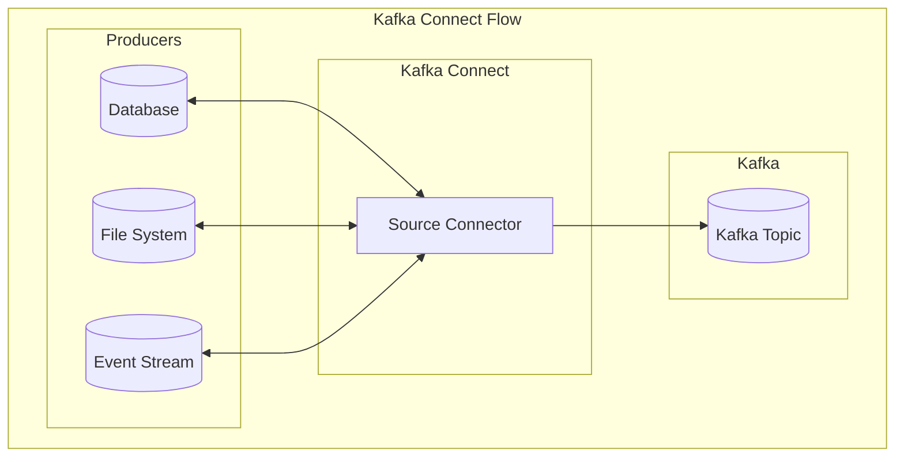
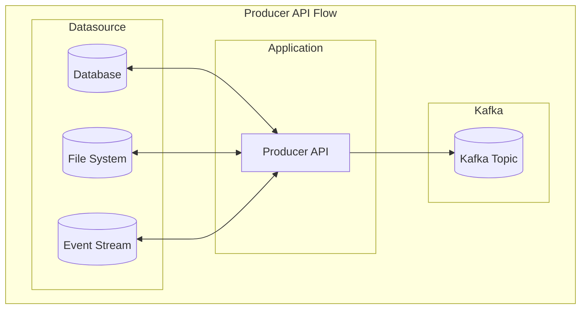
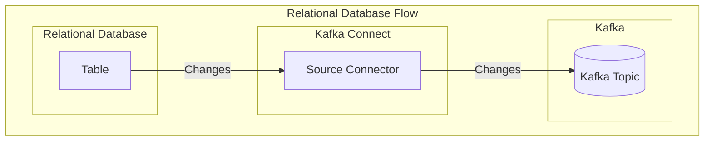
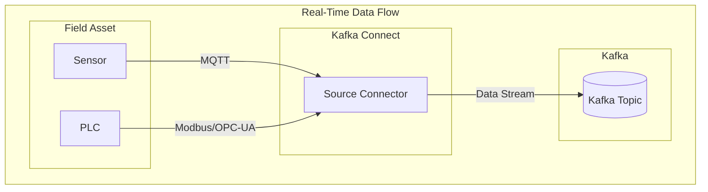

# Producers

This section provides guidance on how to connect as a Kafka producer and publish events to the Kafka
cluster.

## How to Produce Data to Kafka

There are several different ways to produce data to a Kafka cluster. The best way to produce data depends on the
specific use case and requirements.

### Kafka Connect

Kafka Connect is a no-code framework for connecting Kafka with external systems such as databases, key-value stores,
search indexes, and file systems.

Read more about Kafka Connect in the official [Kafka documentation](https://kafka.apache.org/documentation/#connect).

!!! SUCCESS "Prefer Kafka Connect"

    Kafka Connect is the preferred way to integrate as a producer, since it is a scalable and fault-tolerant
    way to ingest data into Kafka without needing to write custom code or modify existing systems.

The diagram below shows how Kafka Connect can be used to ingest data from various sources into a Kafka topic.

In this diagram, the producers (e.g., a database, a file system, or an event stream) are connected to Kafka Connect
using source connectors. The source connectors are responsible for reading data from the producers and writing
it to a Kafka topic.

There are many different pre-built source connectors available for Kafka Connect. Confluent offers [Confluent
Hub](https://www.confluent.io/hub/) where you can find a curated list of connectors that have been tested and
are known to work well. There are also many open source connectors available on GitHub and other platforms.

??? QUESTION "How do I find the right source connector?"

    Start by searching for source connectors with the name of the system you want to connect to. If there is no
    connector for your system, it's worth searching for the protocol or technology you are using. For example, most
    relational databases can be connected to using JDBC, and there are several JDBC source connectors available.

    If you find a connector that suits your needs, you should review its documentation to see if it is actively maintained
    and available with a sufficiently permissive license. For example, some of the connectors offered on Confluent Hub are
    only available with a paid enterprise license.

### Kafka Producer API

The Kafka Producer API is a low-level interface that enables developers to publish events to a Kafka topic. This
API is ideal for scenarios where Kafka Connect is not suitable, such as when publishing data from a custom application
or a system without a pre-built connector. It provides a native method for integrating Kafka with your custom code.

Read more about the Kafka Producer API in the official [Kafka documentation](https://kafka.apache.org/documentation/#producerapi).

!!! WARNING "Avoid the Kafka Producer API"

    The Kafka Producer API is a low-level API that requires developers to write custom code to publish data to Kafka.
    This approach is more complex and error-prone than using Kafka Connect, and it is not recommended unless you have
    a specific use case that cannot be addressed with Kafka Connect.

    If you decide to use the Kafka Producer API, make sure you are familiar with the Kafka documentation and best
    practices for using the API.

The diagram below shows how a custom application can use the Kafka Producer API to publish events to a Kafka topic.

In this example, data is read from a datasource (e.g., a database, a file system, or an event stream) and published
to a Kafka topic using the Kafka Producer API. The application that uses the Producer API is responsible for
reading data from the datasource and publishing it to Kafka.

There are many open source SDKs available for the Kafka Producer API. Here are some recommended ones for popular
programming languages:

| Language   | SDK                                                                                             |
| ---------- | ----------------------------------------------------------------------------------------------- |
| .NET       | [Confluent Kafka .NET Client](https://github.com/confluentinc/confluent-kafka-dotnet)           |
| Java       | [Apache Kafka Java Client](https://kafka.apache.org/documentation/#producerapi)                 |
| JavaScript | [Confluent Kafka JavaScript Client](https://github.com/confluentinc/confluent-kafka-javascript) |
| Python     | [Confluent Kafka Python Client](https://github.com/confluentinc/confluent-kafka-python)         |

## Use Cases

Here are some common use cases for producing data to Kafka:

### Capturing Database Changes

A very common use case for Kafka is capturing changes to a database and publishing them to a Kafka topic. This
allows consumers to react to changes in real-time and build up a complete picture of the data over time.

??? INFO "Change Data Capture (CDC)"

    The process of capturing database changes and publishing them to Kafka is known as [Change Data Capture
    (CDC)](https://en.wikipedia.org/wiki/Change_data_capture). You can use Kafka Connect with a suitable source
    connector to implement CDC for your database. The source connector will read changes from the database's
    transaction log and publish updated events to a Kafka topic.

#### Relational Databases

For relational databases, a common pattern is to monitor a table that represents the current state of a particular
data entity you want to publish to Kafka. The source connector can read from this table and publish any changes
in real-time.

In the example above, the source connector monitors the transaction log for changes to the data in the table
and publishes these changes to a Kafka topic.

??? WARNING "CDC does not work on views"

    Change Data Capture (CDC) does not work on views because changes to views are not captured in the database's
    transaction log.

#### NoSQL Databases

For NoSQL databases, the process is similar, but the implementation details will vary depending on the database
technology you are using. Many NoSQL databases have built-in support for change streams or triggers that can be
used to capture changes and publish them to Kafka.

### Real-Time Data Acquisition

Another common use case for Kafka is real-time data acquisition. This use case is suitable for scenarios where
you have a data stream from a field asset, such as a sensor or a PLC, that you want to publish to Kafka for further
processing.

Kafka Connect is a good fit for this use case, as it provides connectors for most common industrial protocols such
as [Modbus](https://plc4x.apache.org/users/integrations/apache-kafka.html), [OPC-UA](https://www.confluent.io/hub/onewayautomation/ogamma-visual-logger-for-opc),
and [MQTT](https://docs.confluent.io/kafka-connectors/mqtt/current/mqtt-source-connector/overview.html).

In this example, data from field assets such as sensors and PLCs is read by source connectors and published to
a Kafka topic. The data can then be consumed by downstream applications for further processing.

!!! TIP "Data Processing"

    Data collected from field assets tends to be in a raw format that requires further processing before it can be
    effectively used. You can use KSQL or a custom AWS Lambda function to filter, transform, and enrich the data
    before storing it in a database or data lake.

## Keyed events

When producing data to Kafka, you can optionally include a message key with each event. The message key identifies
the event and is used by Kafka to determine which [partition](https://developer.confluent.io/courses/apache-kafka/partitions/)
the event should be written to.

events with the same key are guaranteed to be written to the same partition, which ensures that they are processed
in order by consumers. This can be useful when you need to maintain order guarantees for a specific set of events,
such as create-update-delete operations on a database table.

A common pattern is to use a unique identifier as the message key, such as a primary key from a database table.
