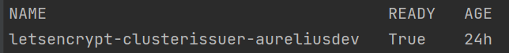
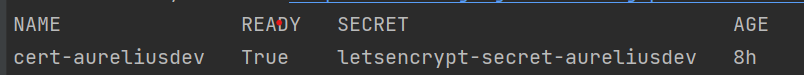

# How to Deploy Aurelius Atlas

Getting started
-------------------------

Welcome to the Aurelius Atlas solution! Aurelius Atlas is an open-source Data Governance solution, based on a selection of open-source tools to facilitate business users to access governance information in an easy consumable way and meet the data governance demands of the distributed data world.


Here you will find the instillation instructions and the required setup of the kubernetes instructions, followed by how to deploy the chart in different namespaces.

Installation Requirements
-------------------------

This installation assumes that you have:
- A kubernetes cluster running
  - with 2 Node of CPU 4 and 16GB
- Chosen cloud Cli installed
  - [gcloud](https://cloud.google.com/sdk/docs/install#deb)
  - [az](https://learn.microsoft.com/en-us/cli/azure/install-azure-cli)
- kubectl installed and linked to chosen cloud Cli
  - [gcloud linked](https://cloud.google.com/kubernetes-engine/docs/how-to/cluster-access-for-kubectl#gcloud)
  - [az linked](https://learn.microsoft.com/en-us/azure/aks/learn/quick-kubernetes-deploy-cli#connect-to-the-cluster)
- Helm installed locally
- A DomainName
  - Not necessary for Azure

## Required Packages
The deployment requires the following packages:
- Certificate Manager
  - To handle and manage the creation of certificates
  - Used in demo: cert-manager
- Ingress Controller
  - Used to create an entry point to the cluster through an external IP.
  - Used in demo: Nginx Controller
- Elastic
  - Used to deploy elastic on the kubernetes cluster
  - In order to deploy elastic, ``Elastic Cluster on Kubernetes (ECK)`` must be installed on the cluster. To install ECK on the cluster, please follow the instructions provided on https://www.elastic.co/guide/en/cloud-on-k8s/master/k8s-deploy-eck.html
  - For more details about this elastic helm chart look at [elastic readme](./charts/elastic/README.md)
- Reflector
  - Used to reflect secrets across namespaces
  - Used in demo to share the DNS certificate to a different namespace

### The steps on how to install the required packages

##### 1. Install Certificate manager
Only install if you do not have a certificate manager. Please be aware if you use another manger, some commands later will need adjustments.
The certificate manager here is [cert-manager](https://cert-manager.io/docs/installation/helm/).

```bash
helm repo add jetstack https://charts.jetstack.io
helm repo update
helm install  cert-manager jetstack/cert-manager   --namespace cert-manager   --create-namespace   --version v1.9.1   --set   installCRDs=true
```

- On GKE environment also add ``--set global.leaderElection.namespace=cert-manager`` to the helm install command ([explanation](https://cert-manager.io/docs/installation/compatibility/#gke))

- It is successful when the output is like this:

  ```console
  NOTES:
  cert-manager v1.91 has been deployed succesfully
  ```

##### 2. Install Ingress Nginx Controller
Only install if you do not have an Ingress Controller.

```bash
helm repo add ingress-nginx https://kubernetes.github.io/ingress-nginx
helm repo update
helm install nginx-ingress ingress-nginx/ingress-nginx --set controller.publishService.enabled=true
```

- On AKS add ``--set controller.service.annotations."service\.beta\.kubernetes\.io/azure-load-balancer-health-probe-request-path"=/healthz``
- It is also possible to set a DNS label to the ingress controller if you do not have a DNS by adding ``--set controller.service.annotations."service\.beta\.kubernetes\.io/azure-dns-label-name"=<label>``

##### 3. Install Elastic
Elasticsearch and Kibana 9 need ECK 3.x:
```bash
kubectl create -f https://download.elastic.co/downloads/eck/3.1.0/crds.yaml
kubectl apply -f https://download.elastic.co/downloads/eck/3.1.0/operator.yaml
```
##### 4. Install Reflector
```bash
helm repo add emberstack https://emberstack.github.io/helm-charts
helm repo update
helm upgrade --install reflector emberstack/reflector
```

## Get Ingress Controller External IP to link to DNS
Only do this if your ingress controller does not already have a DNS applied. In the case of Azure this is not necessary, other possible instructions can be found below in Azure DNS Label
##### Get External IP to link to DNS
```bash
kubectl get service/nginx-ingress-ingress-nginx-controller
```
Take the external-IP of the ingress controller
Link your DNS to this external IP.

In Azure, it is possible to apply a dns label to the ingress controller, if you do not have a DNS.
#### Azure DNS Label
https://learn.microsoft.com/en-us/azure/aks/ingress-tls?tabs=azure-cli#set-the-dns-label-using-helm-chart-settings
Edit the ingress controller deployment (if not set upon installation)
```bash
helm upgrade nginx-ingress ingress-nginx/ingress-nginx --reuse-values --set controller.service.annotations."service\.beta\.kubernetes\.io/azure-dns-label-name"=<label>
```
Resulting DNS will be ``<label>.westeurope.cloudapp.azure.com``


## Put SSL certificate in a Secret

##### Define a cluster issuer
This is needed if you installed cert-manager from the required packages.

Here we define a ClusterIssuer using cert-manager on the cert-manager namespace:
1. Move to the directory of Aurelius-Atlas-helm-chart
2. Uncomment templates/prod_issuer.yaml
3. Update the ``{{ .Values.ingress.email_address }}`` in values.yaml file
4. Create the ClusterIssuer with the following command
  ```bash
  helm template -s templates/prod_issuer.yaml . | kubectl apply -f -
  ```
5. Comment out templates/prod_issuer.yaml

6. Check that it is running:
  ```bash
  kubectl get clusterissuer -n cert-manager
  ```
  It is running when Ready is True.



##### Create SSL certificate
This is needed if you installed cert-manager from the required packages.

0. Assumes you have a DNS linked to the external IP of the ingress controller
1. Move to the directory of Aurelius-Atlas-helm-chart
2. Uncomment templates/certificate.yaml
3. Update the values.yaml file ``{{ .Values.ingress.dns_url}}`` to your DNS name
4. Create the certificate with the following command
  ```bash
  helm template -s templates/certificate.yaml . | kubectl apply -f -
  ```
5. Comment out templates/certificate.yaml

6. Check that it is approved:
  ```bash
  kubectl get certificate -n cert-manager
  ```
  It is running when Ready is True.





Deploy Aurelius Atlas
-------------------------

What the chart installs (one set of containers for several tenants, see `docs/migration/README.md`):

| Component | What | Notes |
| --- | --- | --- |
| `reverse-proxy` | Apache with the Angular frontend (`docker/aurelius-reverse-proxy`) | routes `/<namespace>/<tenant>/...`; sidecar `tenant-sync` keeps its tenant files (Kibana logins) in step with the tenant registry |
| `pyatlas` | metadata server for all tenants (`backend/pyatlas`) | a tenant context per tenant, own Elasticsearch API key per tenant; only the proxy and the Aurelius jobs may call it (NetworkPolicy) |
| `keycloak` | Keycloak 22 in production mode on PostgreSQL | a realm per tenant; database in the pod `<release>-keycloak-postgresql` (volume kept on uninstall) or an external PostgreSQL |
| `elastic` | Elasticsearch 9 and Kibana 9 (ECK) | security on; a Kibana space per tenant |
| `aurelius-filebeat` | log shipper (DaemonSet) | routes the log lines of pyatlas, proxy and Keycloak to `logs-aurelius.<source>-<tenant>` |
| `aurelius-init` | job after every install / upgrade | platform (registry, users, log routing, operators' realm and Kibana space) and the default tenant `m4i` |
| `aurelius-admin` | pod for the tenant administration | `kubectl exec deploy/aurelius-admin -- aurelius-admin ...` |

Images: `ghcr.io/aureliusenterprise/pyatlas`, `aurelius-reverse-proxy` and `aurelius-docker-keycloak`, tag
`global.version` (published by the publish workflow for a release tag `v*.*.*`).

1. Update the values.yaml file
   - `global.external_hostname`: your DNS name
   - `global.version`: the release of the images
   - `sampleData`: `true` loads the Aurelius sample data into the default tenant
   - `keycloak.postgresql`: size of the database volume, or `enabled: false` with `external` for a managed PostgreSQL
2. Create the namespace (it is also the first path segment of every URL)

    ```bash
    kubectl create namespace <namespace>
    ```

3. Deploy the services

    ```bash
    cd aurelius/k8s
    helm install aurelius -n <namespace> -f values.yaml --timeout 20m0s .
    ```

The job `aurelius-init` waits for Elasticsearch and Keycloak and then sets up the platform and the default tenant
(5-10 minutes on a new cluster): `kubectl -n <namespace> logs -f job/aurelius-init-1`.

Once it has finished:

| What | URL |
| --- | --- |
| Frontend of the default tenant | `https://<DNS>/<namespace>/m4i/atlas/` (the old `https://<DNS>/<namespace>/atlas/` redirects) |
| Kibana of the default tenant | `https://<DNS>/<namespace>/m4i/kibana/` (realm users with `ROLE_ADMIN`) |
| Kibana over all tenants | `https://<DNS>/<namespace>/platform/kibana/` (user `operator`) |
| Keycloak admin console | `https://<DNS>/<namespace>/auth/admin/` |
| Lineage API of a tenant | `https://<DNS>/<namespace>/<tenant>/lin_api/` |

#### Check that all pods are running

```bash
watch -n 0.5 kubectl get pods -n <namespace>
```

### Tenants

```bash
A="kubectl -n <namespace> exec deploy/aurelius-admin -- aurelius-admin"
$A tenant create acme --name "ACME" --admin-user anna --admin-email anna@acme.example   # prints anna's temporary password
$A tenant create acme --sample-data /app/sample-data/sample_data.zip                     # optional demo content
$A tenant list
$A tenant entra acme --directory-id <Entra tenant id> --client-id <app id> --client-secret <secret> [--only-entra]
$A tenant suspend acme          # resume acme
$A tenant delete acme --yes
```

A new tenant is reachable at `https://<DNS>/<namespace>/acme/atlas/` at once; its Kibana login works after the
`tenant-sync` sidecar of the proxy has picked it up (30 seconds). A customer's own host name is an ingress rule
that rewrites `https://data.acme.com/` to `/<namespace>/acme/`.

### Keycloak database

Keycloak runs in production mode (`kc.sh start`) on PostgreSQL 15 (`<release>-keycloak-postgresql`, volume of
`keycloak.postgresql.persistence.size`, password generated into the secret `<release>-keycloak-postgresql-secret`).
The volume and the secret are kept by `helm uninstall` (`helm.sh/resource-policy: keep`): they hold the realms and
users of all tenants. Back up the database with

```bash
kubectl -n <namespace> exec deploy/<release>-keycloak-postgresql -- pg_dump -U keycloak keycloak > keycloak.sql
```

For a managed PostgreSQL set `keycloak.postgresql.enabled: false` and `keycloak.postgresql.external` (host, port,
database, a secret with `username` and `password`, optional `jdbcParams` such as `sslmode=require`).

The Keycloak admin (realm `master`) is created with the password of the secret `keycloak-secret` when Keycloak
creates its database; later changes of the secret do not reach Keycloak.  The secret is therefore generated once and
kept (also by `helm uninstall`).  If the two ever differ (charts before 4.0.0-alpha generated a new password on
every upgrade; "invalid username or password" at `/<namespace>/auth/admin/`, `aurelius-init` fails at Keycloak),
set the admin's password in the database to the one of the secret and restart Keycloak:

```bash
NS=<namespace>; REL=<release>
PW=$(kubectl -n $NS get secret keycloak-secret -o jsonpath='{.data.admin-password}' | base64 -d)
read HASH SALT < <(python3 -c 'import sys,os,hashlib,base64; s=os.urandom(16)
print(base64.b64encode(hashlib.pbkdf2_hmac("sha256", sys.argv[1].encode(), s, 27500, 64)).decode(), base64.b64encode(s).decode())' "$PW")
kubectl -n $NS exec -i deploy/$REL-keycloak-postgresql -- psql -U keycloak -d keycloak <<SQL
UPDATE credential SET
  secret_data = '{"value":"$HASH","salt":"$SALT","additionalParameters":{}}',
  credential_data = '{"hashIterations":27500,"algorithm":"pbkdf2-sha256","additionalParameters":{}}'
WHERE type = 'password' AND user_id = (SELECT u.id FROM user_entity u JOIN realm r ON r.id = u.realm_id
                                       WHERE r.name = 'master' AND u.username = 'admin');
SQL
kubectl -n $NS delete pod $REL-keycloak-0
```

### Upgrading from the Apache Atlas chart

The chart no longer contains Apache Atlas, Kafka, Zookeeper, Flink, Enterprise Search, the search API and the REST
services; `helm upgrade` removes them. Keycloak keeps its database (the realm `m4i` becomes the default tenant).
The old Elasticsearch 8.2 held only search copies (App Search engines) that pyatlas does
not use; Elasticsearch cannot jump from 8.2 to 9, so remove the old cluster before the upgrade
(`kubectl -n <namespace> delete elasticsearch elastic-search` and its volumes) and let the chart create a new one.
The old Atlas data lived in Atlas' own store and is not migrated by the chart - export it with the old installation (`backup/`) and import the ZIP into the
default tenant (`https://<DNS>/<namespace>/m4i/atlas2/`, Atlas UI import) or with
`aurelius-admin tenant create m4i --sample-data <zip>`.

### Users with Randomized Passwords
The chart creates these users with random passwords, stored as Kubernetes secrets:

1. Keycloak admin (realm master)
2. Atlas admin, data steward and data scientist of the default tenant (`atlas`, `steward`, `scientist`)
3. `operator` of the realm `platform` (Kibana over all tenants)
4. Elastic user `elastic`

```bash
./get_passwords.sh <namespace>
```

### Enable social login

To enable social login in Aurelius Atlas, please follow the steps below:

1. Register an OAuth 2.0 client application with Google, GitHub or Facebook. (To see the full list please [keycloak website](https://www.keycloak.org/) ) This will be used as an identity provider in Keycloak.
   - [google](https://keycloakthemes.com/blog/how-to-setup-sign-in-with-google-using-keycloak)
   - [github](https://medium.com/keycloak/github-as-identity-provider-in-keyclaok-dca95a9d80ca)
   - [facebook](https://medium.com/@didelotkev/facebook-as-identity-provider-in-keycloak-cf298b47cb84)
2. Update values file ``keycloak.realm_file_name`` (values.yaml) to ``realm_m4i_with_provider.json``
3. Within ``charts/keycloak/realms/realm_m4i_with_provider.json``, replace the client ID and secret with your own credentials:
   - Place your Client ID into: ``identityProviders.config.clientSecret``
   - Place your Client secret into : ``identityProviders.config.clientId``

If your deployment is already running, you can enable the identity provider through the Keycloak UI:
- Navigate to the Keycloak administration console.
- Click "Identity providers" in the menu, then choose the desired provider from the dropdown menu.
- Set the Client ID and Client Secret. The rest of the settings can remain default.

## Loading Sample Demo Data (Optional)

With `sampleData: true` the default tenant gets the Aurelius sample data on its first start; other tenants with
`aurelius-admin tenant create <tenant> --sample-data /app/sample-data/sample_data.zip`.

## Aurelius Atlas backup
See [backup README](./backup/README.md).

## Add user registration option

### Allow user registration

Login as admin user to admin console in Keycloak. In **Login** tab of realm settings turn on **User refistration** option (and **Verify email** if want to verify email too).

### Set email verification

Login as admin user to admin console in Keycloak. In **Login** tab of realm settings turn on **Verify email** option. In **Email** tab fill email and smtp settings. Notice that admin user should have an email to **Test connection** button would work.
